  

 

### What I'm Building

* [**flagon**](https://github.com/KingJayan/flagon) — Tool for running unmodified desktop Java and LWJGL games directly in the browser via WebGL.
* [**desmos-ide**](https://github.com/KingJayan/desmos-ide) — A custom DSL and code editor that compiles down into Desmos math expressions.
* [**gradient**](https://github.com/KingJayan/gradient) — Offline-first iOS app for viewing Home Access Center grades without network lag.
* [**sortd**](https://github.com/KingJayan/sortd) — Background service that automatically organizes files based on custom path rules.
* [**OUTPOST**](https://github.com/KingJayan/OUTPOST) — Singleplayer voxel FPS set in an infinite procedural world.

 

### Stack

Java, TypeScript, Python, React Native, SvelteKit, WebGL, Cloudflare Workers.

---

  <a href="https://jayanpatel.vercel.app">portfolio</a> &nbsp;•&nbsp;
  <a href="https://github.com/KingJayan">github</a> &nbsp;•&nbsp;
  <a href="mailto:jayan@example.com">email</a>

